# TooliRent API Endpoints Diagram

```mermaid
graph TD
    A[TooliRent WebAPI] --> B[AuthController]
    A --> C[ToolsController]
    A --> D[RentalsController]
    A --> E[PaymentsController]
    A --> F[ReviewsController]
    A --> G[ToolCategoriesController]
    A --> H[CustomersController]

    B --> B1[POST /api/auth/login]
    B --> B2[POST /api/auth/register-customer]
    B --> B3[POST /api/auth/register-user]
    B --> B4[POST /api/auth/create-admin]
    B --> B5[GET /api/auth/all-users]
    B --> B6["GET /api/auth/user/{customerId}"]
    B --> B7["PATCH /api/auth/update-role/{userId}"]
    B --> B8["PATCH /api/auth/toggle-active/{customerId}"]
    B --> B9[POST /api/auth/refresh]

    C --> C1[GET /api/tools]
    C --> C2["GET /api/tools/{id}"]
    C --> C3[POST /api/tools]
    C --> C4["PUT /api/tools/{id}"]
    C --> C5["DELETE /api/tools/{id}"]
    C --> C6["GET /api/tools/{id}/rentals"]

    D --> D1[GET /api/rentals]
    D --> D2["GET /api/rentals/{id}"]
    D --> D3[POST /api/rentals/by-user]
    D --> D4[POST /api/rentals/by-customer]
    D --> D5["PUT /api/rentals/{id}"]
    D --> D6["PATCH /api/rentals/{id}/status"]
    D --> D7[GET /api/rentals/my-bookings]
    D --> D8["DELETE /api/rentals/my-bookings/{id}"]
    D --> D9["DELETE /api/rentals/{id}"]
    D --> D10[GET /api/rentals/statistics]

    E --> E1[GET /api/payments]
    E --> E2["GET /api/payments/{id}"]
    E --> E3["PATCH /api/payments/{id}/status"]
    E --> E4["PATCH /api/payments/{id}/method"]

    F --> F1[GET /api/reviews]
    F --> F2["GET /api/reviews/{id}"]
    F --> F3["GET /api/reviews/rental/{rentalId}"]
    F --> F4[POST /api/reviews]
    F --> F5["DELETE /api/reviews/{id}"]

    G --> G1[GET /api/toolcategories]
    G --> G2["GET /api/toolcategories/{id}"]
    G --> G3[POST /api/toolcategories]
    G --> G4["PUT /api/toolcategories/{id}"]
    G --> G5["DELETE /api/toolcategories/{id}"]

    H --> H1[Empty Controller - No endpoints defined]

    style B fill:#e1f5fe
    style C fill:#f3e5f5
    style D fill:#e8f5e8
    style E fill:#fff3e0
    style F fill:#fce4ec
    style G fill:#f1f8e9
    style H fill:#ffebee
```

## API Controller Details

### 🔐 AuthController

- **Authentication & Authorization**
- User registration (Customer, User, Admin)
- JWT token management
- Role management
- User status management

### 🔧 ToolsController

- **Tool Management**
- CRUD operations for tools
- Filtering by category, condition, availability
- Tool rental history

### 📋 RentalsController

- **Rental Management**
- Create rentals by user or customer
- Status management (Pending → Confirmed → PickedUp → Returned)
- User-specific booking management
- Rental statistics

### 💳 PaymentsController

- **Payment Processing**
- Payment status updates
- Payment method management
- Payment history

### ⭐ ReviewsController

- **Review System**
- Customer reviews for rentals
- Rating system (1-5 stars)
- Review management

### 🏷️ ToolCategoriesController

- **Category Management**
- Tool category CRUD operations
- Category-based tool organization

### 👥 CustomersController

- **Customer Management**
- Currently empty (no endpoints defined)
