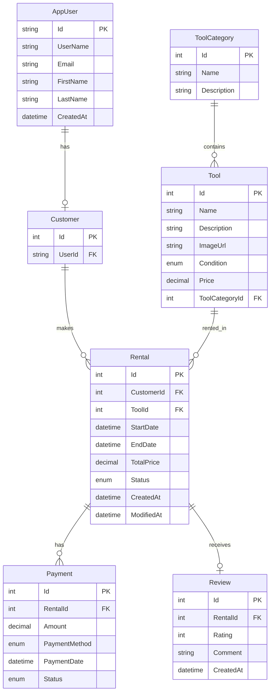

# TooliRent Database Entity Relationship Diagram

## Database Relationships

### Core Entities:
- **AppUser**: Identity user with basic profile information
- **Customer**: Links AppUser to rental system
- **Tool**: Rentable items with categories and pricing
- **ToolCategory**: Classification system for tools
- **Rental**: Core business entity for tool rentals
- **Payment**: Payment tracking for rentals
- **Review**: Customer feedback system

### Key Relationships:
1. **One-to-One**: AppUser ↔ Customer (via UserId)
2. **One-to-Many**: ToolCategory → Tool
3. **One-to-Many**: Customer → Rental
4. **One-to-Many**: Tool → Rental
5. **One-to-Many**: Rental → Payment
6. **One-to-One**: Rental ↔ Review

### Enums Used:
- **ToolCondition**: New, Good, Used, Broken
- **RentalStatus**: Pending, Confirmed, PickedUp, Returned, Cancelled, Overdue
- **PaymentMethod**: Card, Swish, Invoice
- **PaymentStatus**: Pending, Completed, Failed, Refunded

