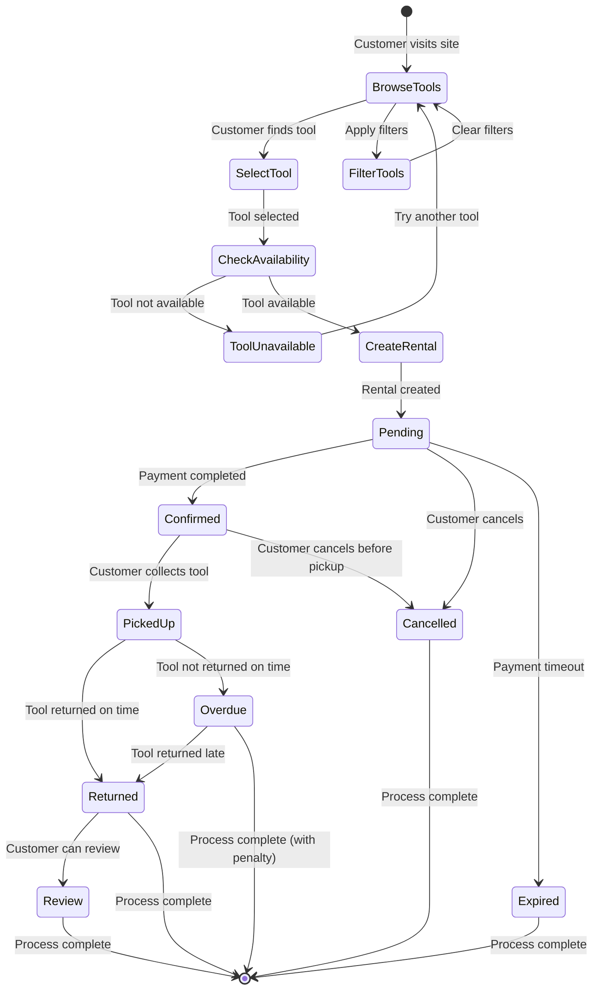

# TooliRent Rental Workflow

## Rental Status Flow

### 📋 Pending
- **Description**: Rental created but not yet paid
- **Actions**: Customer can cancel, Admin can confirm payment
- **Next States**: Confirmed, Cancelled, Expired

### ✅ Confirmed
- **Description**: Payment completed, rental confirmed
- **Actions**: Customer can collect tool, Admin can mark as picked up
- **Next States**: PickedUp, Cancelled

### 📦 PickedUp
- **Description**: Customer has collected the tool
- **Actions**: Customer uses tool, Admin tracks status
- **Next States**: Returned, Overdue

### 🔄 Returned
- **Description**: Tool returned successfully
- **Actions**: Customer can leave review, Admin processes return
- **Next States**: Review, Complete

### ⚠️ Overdue
- **Description**: Tool not returned on time
- **Actions**: Admin contacts customer, applies penalties
- **Next States**: Returned, Complete

### ❌ Cancelled
- **Description**: Rental cancelled by customer or admin
- **Actions**: Process refund if applicable
- **Next States**: Complete

## Key Business Rules

### Tool Availability
- Tools are checked for availability during rental creation
- Overlapping rentals are prevented
- Tool condition affects availability

### Payment Processing
- Multiple payment methods supported (Card, Swish, Invoice)
- Payment status tracking (Pending, Completed, Failed, Refunded)
- Automatic status updates

### Review System
- One review per rental
- 1-5 star rating system
- Optional comments
- Created after tool return

### Admin Controls
- Full rental management
- Status updates
- Customer communication
- Statistics and reporting

