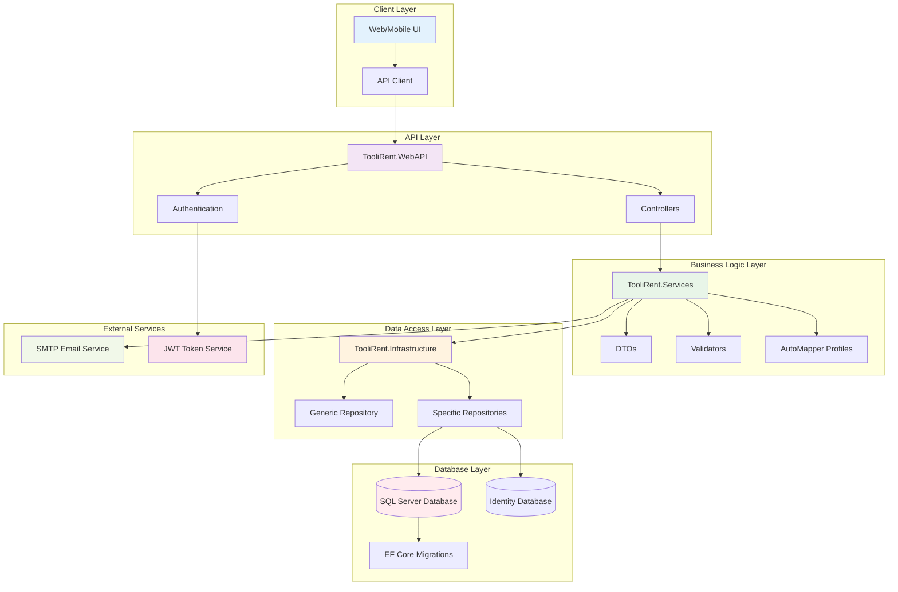

# TooliRent System Architecture

## System Components

### 🎨 Client Layer
- **Web/Mobile UI**: Frontend applications
- **API Client**: HTTP client for API communication

### 🌐 API Layer
- **TooliRent.WebAPI**: Main API project
- **Authentication**: JWT-based authentication system
- **Controllers**: REST API endpoints

### 🏗️ Business Logic Layer
- **Services**: Business logic implementation
- **DTOs**: Data Transfer Objects for API communication
- **Validators**: Input validation using FluentValidation
- **AutoMapper Profiles**: Object mapping configuration

### 💾 Data Access Layer
- **Repositories**: Data access abstraction
- **Generic Repository**: Base repository pattern
- **Specific Repositories**: Entity-specific data access

### 🗄️ Database Layer
- **SQL Server Database**: Main application data
- **Identity Database**: User authentication data
- **EF Core Migrations**: Database schema management

### 🔧 External Services
- **SMTP Email Service**: Email notifications
- **JWT Token Service**: Token generation and validation

## Technology Stack

### Backend
- **.NET 8**: Main framework
- **ASP.NET Core Web API**: REST API framework
- **Entity Framework Core**: ORM
- **SQL Server**: Database
- **ASP.NET Core Identity**: Authentication
- **JWT**: Token-based authentication
- **AutoMapper**: Object mapping
- **FluentValidation**: Input validation

### Architecture Patterns
- **Clean Architecture**: Separation of concerns
- **Repository Pattern**: Data access abstraction
- **DTO Pattern**: Data transfer objects
- **Dependency Injection**: IoC container
- **CQRS-like**: Service layer separation

## Data Flow

1. **Client Request** → API Controller
2. **Controller** → Service Layer
3. **Service** → Repository Layer
4. **Repository** → Database
5. **Response** ← Database ← Repository ← Service ← Controller ← Client

## Security Features

- **JWT Authentication**: Secure token-based auth
- **Role-based Authorization**: Admin, Customer, User roles
- **Password Hashing**: Secure password storage
- **Refresh Tokens**: Token renewal mechanism
- **Input Validation**: Comprehensive data validation

